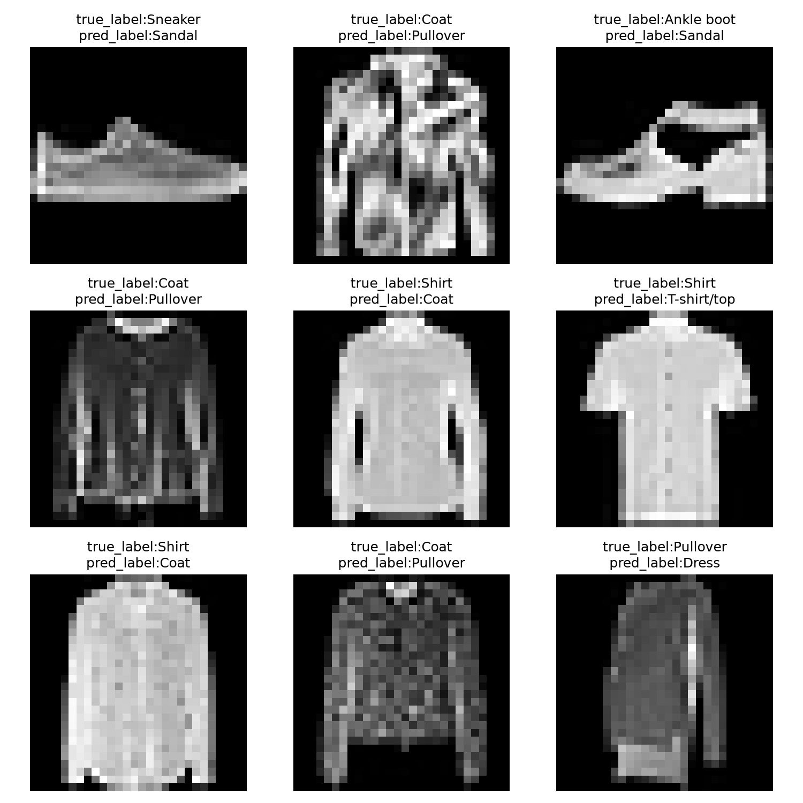

# fashion-classifier
A beginner PyTorch project for Fashion-MNIST classification.

## 项目简介
- 这是我的第一份自我尝试从零搭建的项目，目的是训练我项目的管理和实际工程处理的能力
- This project is my first end-to-end personal project which is built on my own,for the purpose of training my ability of managing a project and dealing with a actual working.

- This is my first personal project that I am developing independently, from planning through implementation. I aim to use it to practice project planning and management, develop my coding and debugging skills, and gain hands-on software engineering experience.
## 任务定义与范围
- 题目为“通过Fashion-MNIST学习Pytorch中数据加载，神经网络训练，验证与GPU推理，并比较CPU和GPU运行的情况”。题目主要围绕神经网络展开，并自行搭建一个机器学习项目，实现对机器学习的工程入门，并了解开源项目搭建过程
- the theme of the project is "With 'To learn about the data-loading in Pytorch,trains ,evaluaiton and GPU inference of the neural network, along with comparing the performance of CPU's and GPU's running with Fashion-MNIST"

- Using the Fashion-MNIST dataset, I will build a neural network in PyTorch to classify 28 × 28 grayscale images of clothing into 10 categories. Through this project, I will learn the main steps in an image-classification workflow, including data loading, model training, validation, and inference on a GPU. I will also compare model training times on the CPU and GPU and learn how to organize a project for open-source collaboration.

The model takes grayscale images of clothing as input and predicts one of 10 categories.
## 数据集
- 本项目使用 torchvision 提供的 Fashion-MNIST 数据集。官方训练集包含 60,000 张图片，测试集包含 10,000 张图片。
- `build_datasets` 将官方训练集按 5:1 划分为训练集和验证集，并保留官方测试集用于最终评估。划分使用随机种子 `42`，以便重复运行时得到相同的训练集和验证集索引。
## 实验环境
```
Python: 3.14.4
PyTorch: 2.10.0+cu128
torchvision: 0.25.0+cu128
PyTorch CUDA runtime: 12.8

PyTorch can use CUDA: True
GPU: NVIDIA GeForce RTX 3050 Laptop GPU
GPU memory GiB: 4.0
```
### 实验设置
| 项目 | 设置 |
| --- | --- |
| 模型结构 | 展平 → 全连接层（784 → 128）→ ReLU → 全连接层（128 → 10） |
| 训练集／验证集／测试集 | 50,000／10,000／10,000 张图片 |
| 批次大小 | 64 |
| 训练轮数 | 5 |
| 损失函数 | 交叉熵（CrossEntropyLoss） |
| 优化器 | Adam |
| 学习率 | 0.001 |
| 参数保存标准 | 验证准确率高于此前最高值时保存 |
| 最终测试设备 | CPU |
## 安装与运行
- 在项目根目录激活虚拟环境，然后运行数据检查脚本：
```bash
source .venv/bin/activate
python inspect_data.py
```
## 实验结果

### 测试集分类结果

| 指标 | 结果 |
| --- | ---: |
| 测试图片数 | 10,000 |
| 平均测试损失 | 0.3888 |
| 测试准确率 | 86.24% |
| 预测错误数 | 1,376 |

错误图片九宫格展示了测试遍历中遇到的前九张预测错误图片，用于观察具体误判。它们不是随机抽样，也不代表全部错误的类别分布。



### CPU 与 CUDA 单轮训练耗时

| 设备 | 训练图片数 | 训练耗时（秒） |
| --- | ---: | ---: |
| CPU | 50,000 | 2.9031 |
| CUDA | 50,000 | 3.6914 |

这次对照测量的是一轮完整训练流程，计时包含数据迭代、设备迁移、模型训练和统计。CUDA 在本次运行中耗时更长；这只是当前实验条件下的一次测量，不代表其他设备或任务的普遍表现。
## 项目结构
```text
fashion-classifier/
├── data.py                  # 创建数据集划分和 DataLoader
├── inspect_data.py          # 检查数据并保存样本图片
├── model.py                 # 定义 FashionMLP 模型
├── inspect_model.py         # 检查模型前向计算和输出形状
├── inspect_train_step.py    # 检查一次损失计算、反向传播和参数更新
├── train.py                 # 多轮训练、验证并保存选定参数
├── inspect_checkpoint.py    # 加载参数并检查单批前向计算
├── benchmark_train.py       # 比较 CPU/CUDA 单轮训练耗时
├── evaluate.py              # 完整测试并生成错误图片
├── reports/
│   ├── samples.png          # 数据检查生成的样本图片
│   └── errors.png           # 测试集错误图片九宫格
├── data/                    # 下载的数据集
└── README.md                # 项目说明、运行方式和实验结果
```
## 实验记录
| 检查项 | 结果 |
| --- | --- |
| 训练集 / 验证集 / 测试集 | 50,000 / 10,000 / 10,000 |
| 图片批次形状 | 已检查：`[64, 1, 28, 28]` |
| 图片数据类型 | 已检查：`torch.float32` |
| 图片像素范围 | 已检查：当前批次最小值为 `0.0`，最大值为 `1.0` |
| 数据划分检查 | 已通过：索引无重复、无遗漏；相同种子可复现，不同种子会产生不同划分 |
| 模型批次输出形状 | 已运行 `inspect_model.py` 验证；结果为 `[64, 10]` |
| 模型单张图片输出形状 | 已运行 `inspect_model.py` 验证；结果为 `[1, 10]` |
| 模型输出有限值检查 | 已运行 `inspect_model.py` 验证；审查通过|
## 已知限制
- 当前程序从 `/home/hp/fashion-classifier/fashion_mlp.pt` 读取模型参数。如果项目移动到其他目录或设备，需要相应调整代码中的参数文件路径。
- 数据集划分使用固定随机种子 `42`，但训练脚本没有固定模型初始化和数据打乱等随机过程。因此，重新训练时不能保证得到完全相同的模型参数和实验指标。
- 本项目使用 Fashion-MNIST 数据集中的标准服饰图片进行训练和测试，尚未验证模型对真实拍摄衣物照片的识别效果。
## 后续计划

## 许可证
